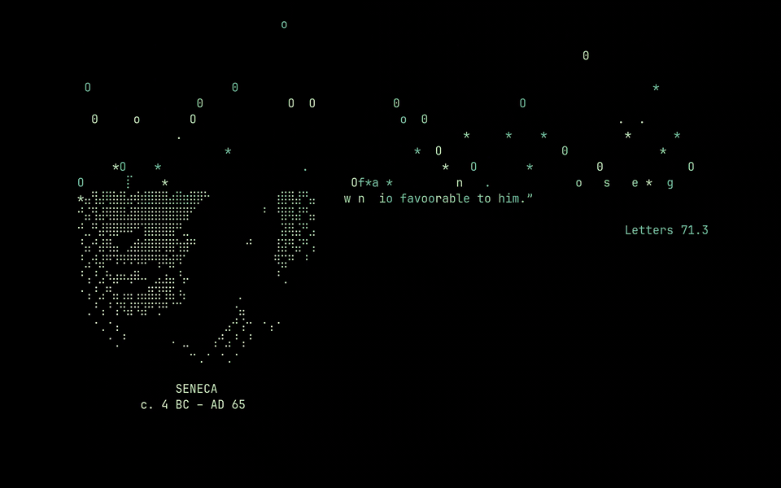

# Omastoic

**The Stoics on your Omarchy screensaver.** When the screen goes idle, Marcus
Aurelius looks back at you out of the Munich Glyptothek and reminds you that the
thing bothering you is your opinion of the thing. A minute later it is Seneca, or
Epictetus, or the man who founded the whole school on an Athenian porch.



Six Stoics, each with a portrait transcoded from a museum photograph, and 64
quotes from public-domain translations, every one cited by book and section.
A longer clip is in [demo.mp4](demo.mp4).

## Install

Requires Omarchy 4+ and [bun](https://bun.sh) (`omarchy pkg add bun`).

```bash
omarchy plugin add https://github.com/rastermanden/omastoic.git --enable --yes
```

That clones the plugin into `~/.config/omarchy/plugins/omastoic`, backs up
whatever screensaver art you had, writes the first canvas, puts `omastoic` on
your PATH, adds a row to the Omarchy menu, and starts a small user service that
swaps in a new quote every 20 seconds while the screensaver is actually on
screen. See it right now:

```bash
omastoic preview
```

From a checkout instead:

```bash
./install.sh          # copies a clean tree into ~/.config/omarchy/plugins/omastoic and sets up
./uninstall.sh        # removes service, menu row, launcher and the plugin; keeps your quotes
```

Update a published install with `omarchy plugin update omastoic`. Remove it
with `omastoic uninstall && omarchy plugin remove omastoic` — that keeps
your quotes and settings for a later reinstall; `omastoic uninstall --purge`
removes those too.

## Switching screensavers

The screensaver art is one slot, and Omarchy already has a place for it, so
that's where the switch lives: **Style → Screensaver** in the Omarchy menu, next
to Edit Text, Set From Image and Restore Default.

**Choose** opens a grid of previews — the same picker Omarchy uses for
backgrounds and unlock screens — with a tile per screensaver. Each tile is drawn
at the size it will really appear on your screen, so a short piece of art shows
short rather than blown up to fill the frame. **Stoics** is a straight toggle
alongside it, carrying a ✓ when they have the slot.

From a terminal:

```bash
omastoic choose        # the grid of previews
omastoic slates        # list what you can switch between
omastoic use Omarchy   # switch by name
omastoic off           # back to the last fixed art you chose
omastoic on            # the Stoics again
omastoic toggle        # whichever of the two you are not on
```

Out of the box there are three: **Stoics**, **Previous** (whatever was in the
slot before omastoic arrived, kept once and never overwritten) and **Omarchy**
(the stock logo). Drop any ASCII or braille art in as
`~/.config/omastoic/screensavers/<Name>.txt` and it joins the grid under that
name. Art that omastoic displaces later is kept as **Replaced**, so one undo is
always on the grid.

**Omarchy's own commands win.** Set the art with `omarchy branding screensaver
image` (or `text`, or `reset`) and omastoic notices the slot is no longer its
own, turns itself off and leaves the new art alone — rather than quietly
reverting you on the next rotation, which would look like a bug in Omarchy. Turn
the Stoics back on whenever you want them.

`omastoic uninstall` removes the service, menu row and launcher, and restores
your old art. Follow it with `omarchy plugin remove omastoic` so the plugin
does not set itself up again on the next shell start.

State lives where Omarchy keeps its own: the on/off flag is
`omarchy-toggle omastoic`, which is what the menu row's ✓ reads.

## How it works

Omarchy's screensaver runs `ttfx` in a fullscreen terminal, in a loop, over
`~/.config/omarchy/branding/screensaver.txt` — and it re-reads that file every
time round the loop. So Omastoic replaces, shadows and patches nothing: it just
keeps a freshly composed canvas in the file Omarchy already reads, and swaps it
for another one between effects.

The service listens on Hyprland's event socket rather than polling. It wakes when
a window of class `org.omarchy.screensaver` opens, rotates quotes while one is up,
writes one last canvas when the screensaver closes so the next one is already
fresh, and then goes back to sleep. Nothing runs on a timer when you are working.

The canvas is sized for the smallest attached monitor, from the cell size the
screensaver terminal actually uses. If a screen is too small for a portrait — a
short terminal, mostly — the quote is laid out on its own instead.

## Commands

| Command | Does |
| --- | --- |
| `omastoic on` | hand the screensaver to the Stoics |
| `omastoic off` | give it back to whatever art was there before |
| `omastoic toggle` | whichever of the two you are not on |
| `omastoic preview` | write a new canvas and start the screensaver now |
| `omastoic status` | who has the screensaver, and what's in the quote book |
| `omastoic setup` | rotation service, menu row and launcher (safe to re-run) |
| `omastoic install` | setup, then hand the screensaver to the Stoics |
| `omastoic uninstall` | take the service, menu row and launcher back out |
| `omastoic show` | print one canvas at this terminal's size |
| `omastoic next` | put a new canvas in the screensaver file |

## Making it yours

**Your own quotes** go in `~/.config/omastoic/quotes.tsv`, in the same three
tab-separated columns as `data/quotes.tsv` — author slug, citation, text. They
are added to the book, not swapped in for it. An author slug with a portrait in
`art/` gets that portrait; anything else renders as a quote on its own.

**Settings** live in `~/.config/omastoic/config.json`:

```json
{
  "interval": 20,
  "authors": ["marcus", "epictetus"]
}
```

`interval` is seconds between quotes while the screensaver is up. `authors`
narrows the roster — leave it out for all six.

**Portraits.** `art/*.txt` is generated, not hand-drawn. To change one, or add a
seventh Stoic, add an entry to `assets/portraits.json` — source filename, crop,
and the three tone numbers — then:

```bash
./scripts/fetch-sources.sh      # downloads the sources from Wikimedia Commons
bun scripts/transcode.ts        # rebuilds art/, or one slug: ... transcode.ts zeno
```

A photograph needs more than the hard threshold a logo transcoder uses; a bust
thresholded flat is a white blob. Each portrait is blurred just enough to lose
the marble's grain, levelled so the sitter's own shadows survive, masked with a
soft ellipse so the museum wall behind it does not, and halftoned with a
clustered 4×4 pattern — which the braille grid renders as tone, where a
diffusion dither at this size turns into static.

`scripts/preview.sh <canvas.txt>` renders a canvas to a PNG at the terminal's
cell aspect ratio, which is the quickest way to judge a new portrait.

## Tests

```bash
bun test
```

Checks the quote book parses, every author has a portrait and dates, and every
quote in the book lays out inside the smallest grid the layout claims to
support — including the fallback when there is no room for a portrait. The menu
tests cover the part most likely to hurt someone: that adding and removing the
menu row leaves the rest of `omarchy-menu.jsonc` — comments, and other tools'
blocks — exactly as it was found.

## Credits

Portrait sources and translations are listed in [CREDITS.md](CREDITS.md). Every
image is public domain or CC0, and every translation is out of copyright.

MIT licensed.
